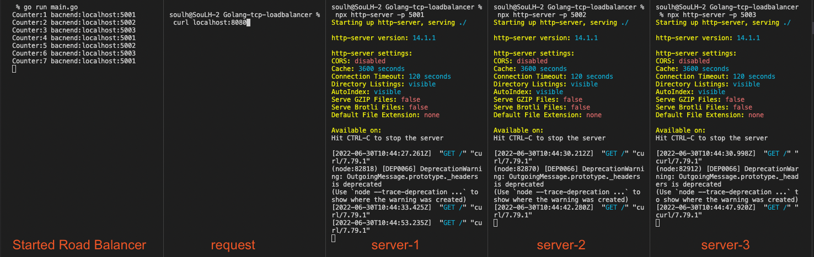

# Golang-TCP-LoadBalancer

### Starting (M1-ARM64)

```
go mod tidy

```

```
Start

go run main.go

```

```
Server creation

npx http-server -p 5001
npx http-server -p 5002
npx http-server -p 5003

```


```
Request
curl localhost:8080

```


<p>
    

</p>


####    Thank You Ahmet Balkan
